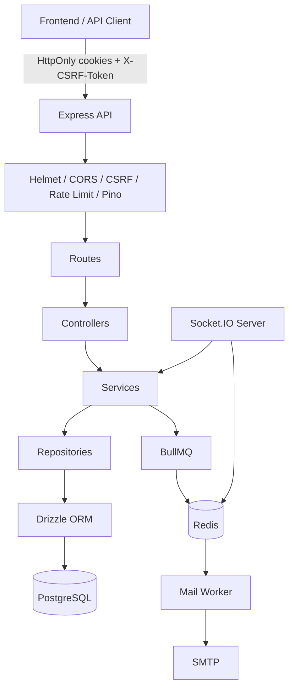
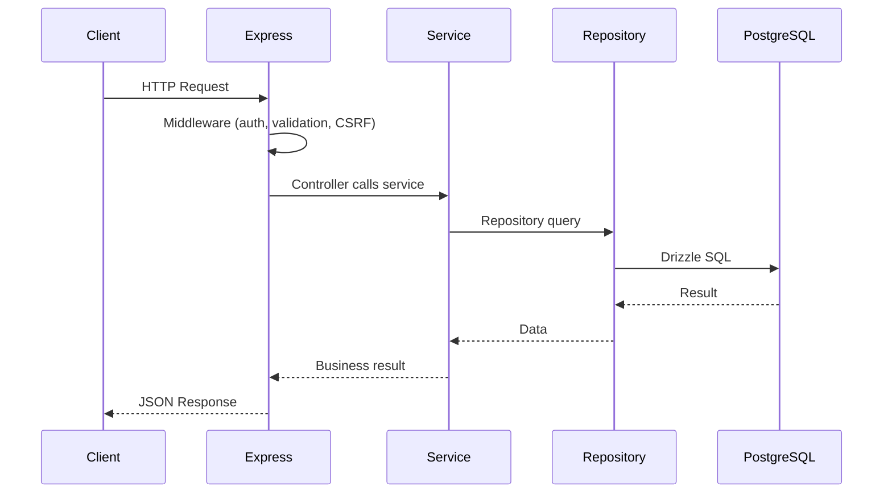
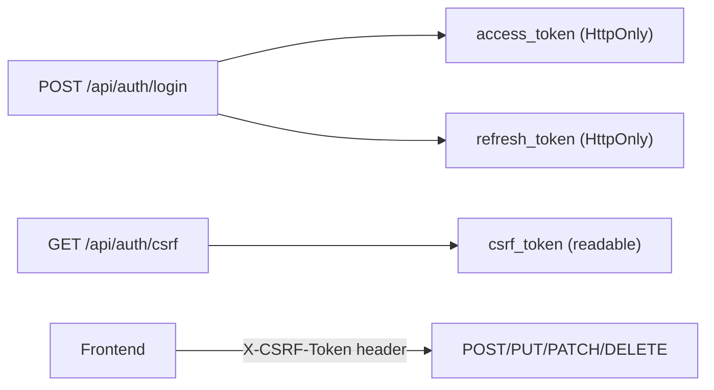

# 🚀 Nodejs Express Starter Template

> Production-oriented **API-only** backend template built with Node.js, TypeScript, and Express 5 — ready to clone and extend into your next project.

[](https://nodejs.org/)
[](https://www.typescriptlang.org/)
[](https://expressjs.com/)
[](https://www.postgresql.org/)
[](https://redis.io/)

---

## 📖 What is this?

This repository is a **reusable backend starter template** — not a finished product with CRUD features. It gives you:

- ✅ Layered **MVC architecture** (Routes → Controllers → Services → Repositories)
- ✅ **JWT + HttpOnly cookie** authentication with refresh token rotation
- ✅ **CSRF protection** for cookie-based auth (Next.js compatible)
- ✅ **PostgreSQL + Drizzle ORM** with migrations
- ✅ **Redis** for rate limiting, BullMQ jobs, and Socket.IO scaling
- ✅ **Background workers** (BullMQ + Nodemailer + Handlebars email templates)
- ✅ **Socket.IO** with Redis adapter and JWT handshake auth
- ✅ **OpenAPI / Swagger UI** generated from Zod schemas
- ✅ **Pino** structured logging (pretty in dev, JSON stdout in prod)
- ✅ **Docker Compose** for local dev and isolated test infrastructure
- ✅ **PM2** ecosystem for production process management
- ✅ **Jest + Supertest** integration tests against real PostgreSQL

---

## 🧱 Tech Stack

| Category         | Technology                                  |
| ---------------- | ------------------------------------------- |
| Runtime          | Node.js 24 LTS                              |
| Package Manager  | Yarn 4 (Corepack)                           |
| Language         | TypeScript (ESM, NodeNext, strict)          |
| HTTP             | Express 5                                   |
| Validation       | Zod 4                                       |
| Database         | PostgreSQL + Drizzle ORM                    |
| Cache / Queues   | Redis + BullMQ                              |
| Auth             | Passport.js + JWT + Argon2id                |
| Real-time        | Socket.IO + Redis adapter                   |
| Email            | Nodemailer + Handlebars                     |
| Logging          | Pino + pino-http (stdout)                   |
| API Docs         | @asteasolutions/zod-to-openapi + Swagger UI |
| Testing          | Jest + Supertest (real PostgreSQL)          |
| Containerization | Docker + Docker Compose                     |
| Process Manager  | PM2                                         |

---

## 🏗 Architecture



### Request flow



### Auth cookie model



> **Note:** This template is **backend-only**. Next.js references in docs describe how a separate frontend should consume this API — no frontend is included here.

---

## 📁 Project Structure

```text
src/
├── config/          # Zod-validated environment configuration
├── db/              # Drizzle client + single schema.ts
├── routes/          # HTTP route definitions
├── controllers/     # Thin HTTP handlers
├── services/        # Business logic
├── repositories/    # Database access only
├── schemas/         # Zod validation + OpenAPI schemas
├── middleware/      # Auth, CSRF, rate limit, errors
├── auth/            # Passport, JWT, password hashing
├── jobs/            # BullMQ queues and workers
├── mail/            # Nodemailer + Handlebars templates
├── socket/          # Socket.IO server and handlers
├── docs/            # OpenAPI document generation
├── observability/   # Pino logger + HTTP request logging
├── health/          # Health check controllers
└── lib/             # Generic cross-cutting helpers

tests/
├── factories/       # Test data factories
├── helpers/         # Auth, DB, request helpers
└── integration/     # API + DB integration tests
```

---

## 🛠 Quick Start

### Prerequisites

| Tool    | Version          |
| ------- | ---------------- |
| Node.js | 24 LTS           |
| Yarn    | 4 (via Corepack) |
| Docker  | Latest           |

### 1️⃣ Clone and install

```bash
git clone <your-repo-url>
cd nodejs_express_backend_template
corepack enable
yarn install
```

### 2️⃣ Configure environment

```bash
cp .env.example .env
cp .env.test.example .env.test
```

Edit `.env` with your local values (defaults work with Docker Compose).

### 3️⃣ Start infrastructure

```bash
yarn docker:up
```

Starts **PostgreSQL** (port 5432) and **Redis** (port 6379).

### 4️⃣ Run migrations

```bash
yarn db:migrate
```

### 5️⃣ Start the API

```bash
yarn dev              # API server (port 3000)
yarn dev:worker       # BullMQ mail worker
yarn dev:socket       # Socket.IO server (port 3001)
```

### 6️⃣ Verify

| Endpoint             | Description                    |
| -------------------- | ------------------------------ |
| `GET /health/live`   | Liveness probe                 |
| `GET /health/ready`  | Readiness (PostgreSQL + Redis) |
| `GET /api/docs`      | Swagger UI                     |
| `GET /api/auth/csrf` | CSRF token for frontend        |

---

## 📜 Available Scripts

| Script                | Description                   |
| --------------------- | ----------------------------- |
| `yarn dev`            | Start API with hot reload     |
| `yarn dev:worker`     | Start mail worker             |
| `yarn dev:socket`     | Start Socket.IO server        |
| `yarn build`          | Compile TypeScript            |
| `yarn start`          | Run compiled API              |
| `yarn typecheck`      | TypeScript check              |
| `yarn lint`           | ESLint                        |
| `yarn format:check`   | Prettier check                |
| `yarn test`           | Run integration tests         |
| `yarn test:ci`        | CI test run with coverage     |
| `yarn validate`       | Full quality gate             |
| `yarn db:generate`    | Generate Drizzle migration    |
| `yarn db:migrate`     | Apply migrations              |
| `yarn db:check`       | Validate schema vs migrations |
| `yarn docker:up`      | Start dev infrastructure      |
| `yarn docker:down`    | Stop dev infrastructure       |
| `yarn security:check` | Yarn audit (high severity)    |

---

## 🔐 Environment Variables

| Variable             | Required | Description                           |
| -------------------- | -------- | ------------------------------------- |
| `NODE_ENV`           | ✅       | `development` / `test` / `production` |
| `PORT`               | ✅       | API port (default: 3000)              |
| `DATABASE_URL`       | ✅       | PostgreSQL connection string          |
| `REDIS_URL`          | ✅       | Redis connection string               |
| `JWT_ACCESS_SECRET`  | ✅       | Min 32 chars                          |
| `JWT_REFRESH_SECRET` | ✅       | Min 32 chars                          |
| `CSRF_SECRET`        | ✅       | Min 32 chars                          |
| `CORS_ORIGINS`       | ✅       | Comma-separated allowed origins       |
| `SMTP_*`             | ✅       | Email configuration                   |
| `LOG_LEVEL`          | ❌       | Pino log level (default: `info`)      |

See [`.env.example`](.env.example) for the full list.

---

## 🧪 Testing

Tests use a **real PostgreSQL database** (never SQLite) via isolated Docker services:

```bash
docker compose -f compose.test.yaml up -d --wait
yarn test:ci
docker compose -f compose.test.yaml down -v
```

Tests verify both **HTTP responses** and **database state** — repositories are not mocked.

---

## ➕ Adding a New Feature

Follow the layered MVC pattern:

```text
1. Add table(s) to src/db/schema.ts
2. yarn db:generate && yarn db:migrate
3. Create repository in src/repositories/
4. Create service in src/services/
5. Create Zod schema in src/schemas/
6. Create controller in src/controllers/
7. Wire route in src/routes/
8. Add integration tests in tests/integration/
```

See [`AGENT.md`](AGENT.md) for detailed coding rules and [`docs/development.md`](docs/development.md) for workflow details.

---

## 🐳 Docker Production

```bash
docker compose -f compose.prod.yaml up --build
```

Runs API (PM2 cluster), worker, socket, PostgreSQL, and Redis.

---

## 📚 Documentation

| Document                                       | Description                               |
| ---------------------------------------------- | ----------------------------------------- |
| [`AGENT.md`](AGENT.md)                         | Coding rules for developers and AI agents |
| [`docs/architecture.md`](docs/architecture.md) | Architecture deep dive                    |
| [`docs/development.md`](docs/development.md)   | Local development guide                   |
| [`docs/deployment.md`](docs/deployment.md)     | Production deployment                     |
| [`docs/security.md`](docs/security.md)         | Security practices                        |

---

## 📄 License

MIT — use freely as a GitHub template for new backend projects.
